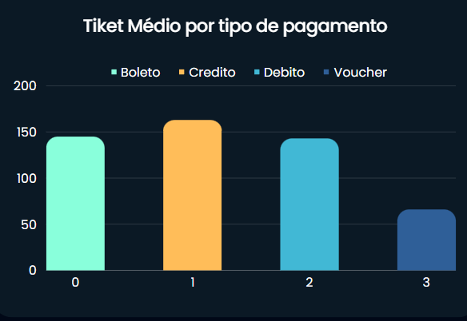
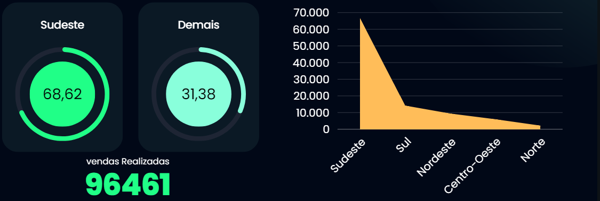
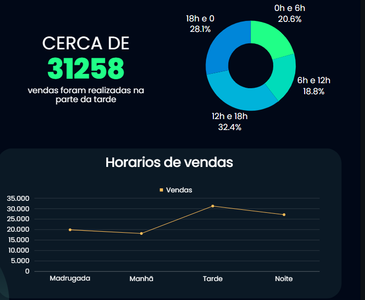
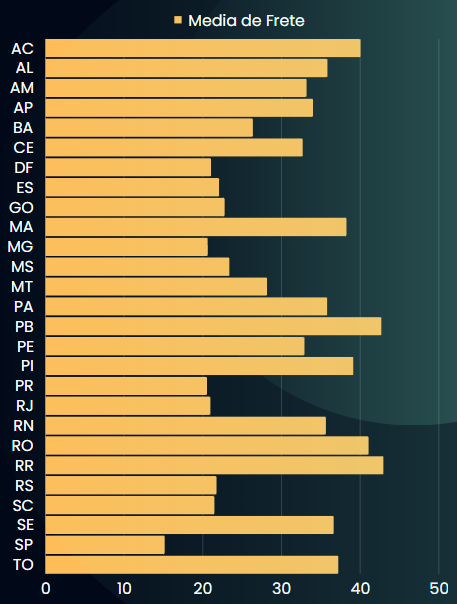
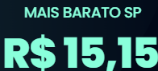
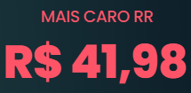

<h1 align ="center"> 
    
    
Análise de Big Data 

</h1>

## 📙 Sobre

O projeto em questão tem como objetivo simular o papel de engenheiros de dados em uma empresa de e-commerce, utilizando o conjunto de dados público chamado 'Brazilian E-Commerce Public Dataset by Olist'. A ideia é extrair insights valiosos para aprimorar as operações de negócios, otimizar a logística e melhorar a experiência do cliente.

## 📈 Função da estruturação e análise de dados 📉

Coleta organiza e disponibiliza dados transformando em informações úteis para tomada de decisão, o Engenheiro coleta os dados da empresa organiza e limpa eles para que possam ser úteis e os lideres ou gerente possa tomar decisões baseado nos números e não somente na intuição.

## 🔨 Ferramentas

- [Python](https://www.python.org/doc/) 🐍
- [Pandas](https://pandas.pydata.org/docs/) 🐼
- [Numpy](https://numpy.org/doc/stable/) 🎲
- [Streamlit](https://docs.streamlit.io/) 📈
- [Matplotlib](https://matplotlib.org/stable/index.html) 📊
- SQL

## 📃 License

This Project is under the MIT license. See the file LICENSE for more details.

## 🔍 Análise 

<h1 align="center">
Ticket Médio
</h1>

Analisando os resultados podemos definir qual o Ticket Médio de cada tipo de venda.

Isso impacta diretamente no faturamento levado em conta as taxas aplicadas para cada tipo de recebimento.

Observando a variação a empresa pode levar em consideração uma renegociação de taxas ou até mesmo o desenvolvimento do seu próprio getway de pagamento.

   

<h1 align="center">
Vendas por região
</h1>

 Com relaçãoa vendas por região percebemos a discrepância que a região sudeste representa com relação a outras.

   

<h1 align="center">
Horário
</h1>

Analisando os dados percebemos a alta nas vendas entre as 12 e 18.

Este dado é importante para definir as campanhas que levam diretamente ao checkout. 

Usando como base os horários em que os clientes estão mais dispostos a fechar uma venda.

   

<h1 align="center">
Média Frete
</h1>

 
Um dos motivos mais certeiros para uma compra não ser finalizada é o valor do frete.

O E-commerce conecta o Brasil todo mas nada adianta se não tiver uma Logística bem estabelecida para diminuir nos custos de entrega desse produto. 

   

<h1 align="center">Conclusão</h1>

>
Nossas análises resultaram em um volume de dados consistente que juntos retratam diversos aspectos e características de nossas operações. Identificamos os meios de pagamento mais utilizados, horários e períodos do ano em que as vendas prospectam de forma crescente e decrescente, sendo assim, poderemos tomar ações para diminuir a lacuna entre o pico de vendas e o vale tornando nossos resultados mais lineares. Com uma operação linear  positiva é possível distribuir as vendas ao longo do ano resultando em um volume de caixa positivo o ano todo e um controle financeiro saudável com margem financeira para investimentos potencializando as categorias de maior rentabilização, prospectando novos fornecedores e negociação para ganho de margem. 

Olhando do lado cliente nossos insights proporcionam uma melhor experiência de compra e soluções logísticas que possam diminuir tanto o tempo de entrega quanto o valor do frete em regiões extremas do território nacional. Trazendo maior competitividade frente à nossos concorrentes e melhor experiência de compra ao consumidor fortificando a marca e nos consolidando em um mercado tão competitivo quanto o virtual. 

